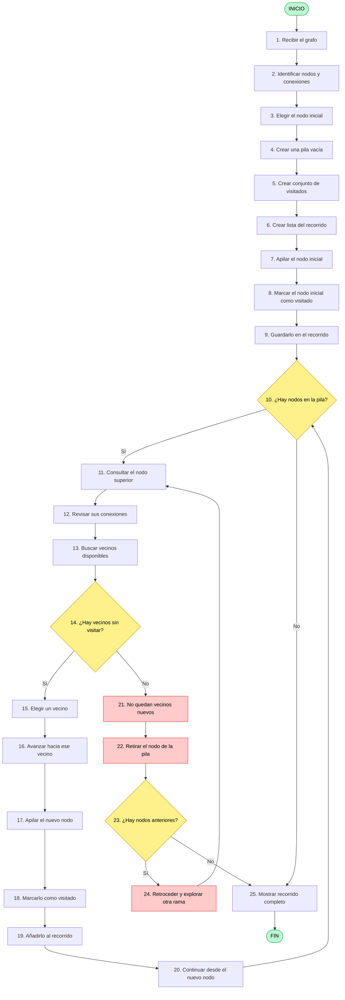

```mermaid
flowchart TD
    A(["INICIO"])
    B["1. Recibir el grafo"]
    C["2. Identificar nodos y conexiones"]
    D["3. Elegir el nodo inicial"]
    E["4. Crear una pila vacía"]
    F["5. Crear conjunto de visitados"]
    G["6. Crear lista del recorrido"]
    H["7. Apilar el nodo inicial"]
    I["8. Marcar el nodo inicial como visitado"]
    J["9. Guardarlo en el recorrido"]
    K{"10. ¿Hay nodos en la pila?"}
    L["11. Consultar el nodo superior"]
    M["12. Revisar sus conexiones"]
    N["13. Buscar vecinos disponibles"]
    O{"14. ¿Hay vecinos sin visitar?"}
    P["15. Elegir un vecino"]
    Q["16. Avanzar hacia ese vecino"]
    R["17. Apilar el nuevo nodo"]
    S["18. Marcarlo como visitado"]
    T["19. Añadirlo al recorrido"]
    U["20. Continuar desde el nuevo nodo"]
    V["21. No quedan vecinos nuevos"]
    W["22. Retirar el nodo de la pila"]
    X{"23. ¿Hay nodos anteriores?"}
    Y["24. Retroceder y explorar otra rama"]
    Z["25. Mostrar recorrido completo"]
    FIN(["FIN"])

    A --> B --> C --> D --> E --> F --> G --> H --> I --> J --> K
    K -->|Sí| L --> M --> N --> O
    O -->|Sí| P --> Q --> R --> S --> T --> U --> K
    O -->|No| V --> W --> X
    X -->|Sí| Y --> L
    X -->|No| Z
    K -->|No| Z
    Z --> FIN

    style A fill:#bbf7d0,stroke:#16a34a,color:#000
    style FIN fill:#bbf7d0,stroke:#16a34a,color:#000
    style K fill:#fef08a,stroke:#ca8a04,color:#000
    style O fill:#fef08a,stroke:#ca8a04,color:#000
    style X fill:#fef08a,stroke:#ca8a04,color:#000
    style V fill:#fecaca,stroke:#dc2626,color:#000
    style W fill:#fecaca,stroke:#dc2626,color:#000
    style Y fill:#fecaca,stroke:#dc2626,color:#000
```
  